# Travelboard :earth_americas::v:
 

## Dokumentacja:
- [Charakterystyka  oprogramowania](#id-section1)
- [Prawa autorskie](#id-section2)
- [Specyfikacja wymagań](#id-section3)
- [Projekt (język UML)](#id-section4)
- [Architektura systemu/oprogramowania](#id-section5)
- [Scenariusze testów](#id-section6)

## 1. Charakterystyka  oprogramowania 
Nazwa skrócona: TravelBoard

Nazwa pełna: TravelBoard - asystent podróżnika

Krótki opis: Aplikacja mobilna służąca jako asystent podróży, która pomoże użytkownikowi w wyborze atrakcji w podróży, pokazująca prognozę pogody w określonym miejscu i pozwalająca po przejrzeniu informacji prowadzić osobisty dziennik wpisów.

## 2. Prawa autorskie 
Autorzy: Eliza Sinkevich, Hanna Zhuk, Irina Frolova

Licencja: MIT

## 3. Specyfikacja wymagań

#### Wymagania funkcjonalne
| Identyfikator | Kategoria | Podkategoria | Nazwa krótka | Opis | Priorytet |
|:-:|:-:|:-|:-|:-|:-:|
|1|funkcjonalne|Autoryzacja|Logowanie|Możliwość zalogowania się na swój profil|1|
|2|funkcjonalne|Autoryzacja|Rejestracja|Możliwość rejestracji i utworzenia swojego profilu|1|
|3|funkcjonalne|Nawigacja|Wybór miasta|Możliwość ustawienia miasta|1|
|4|funkcjonalne|Nawigacja|Mapa z atrakcjami|Wyświetlenie mapę regionu wraz z orientacyjną lokalizacją atrakcji w postaci pinezek na mapie|1|
|5|funkcjonalne|Dostosowanie wyników|Informacja o atrakcji|Po kliknięciu na pinezkę system powinien wyświetlić podstawowe informacje o atrakcji: nazwę, opis, lokalizację|2|
|6|funkcjonalne|Dostosowanie wyników|rzeglądanie atrakcji|Przeglądania atrakcji z opisem w sposób przewijania|2|
|7|funkcjonalne|Projektowe|Pogoda|Wyświetlenie informacje meteorologiczne w zakładce "Pogoda"|3|
|8|funkcjonalne|Projektowe|Podłączenie bazy danych|Zapis danych z wykorzystaniem SQLite|2|

#### Wymagania niefunkcjonalne
| Identyfikator | Kategoria | Podkategoria | Nazwa krótka | Opis | Priorytet |
|:-:|:-:|:-|:-|:-|:-:|
|1|niefunkcjonalne|Statystyki|Zapis statystyk ulubionych atrakcji|Dokładny zapis statystyk ulubionych atrakcji użytkownika do systemu doboru podobnych|1|
|2|niefunkcjonalne|GUI|Nawigacja|Szybka nawigacja w aplikacji |1|
|3|niefunkcjonalne|GUI|Wygląd interfejsów|Intuicyjny i estetyczny interfejs|1|
|4|niefunkcjonalne|Bezpieczeństwo|Ocena cyberbezpieczeństwa|Ocena bezpieczeństwa skupia się na zredagowaniu protokołów bezpieczeństwa oraz list kontrolnych, wprowadzeniu standardów pisania kodu, wprowadzeniu zapór bezpieczeństwa i strategii długoterminowej.|3|
|5|niefunkcjonalne|Bezpieczeństwo|Testy penetracyjne|Ocena bieżącego stanu bezpieczeństwa w sposób przeprowadzeniu kontrolowanego ataku|3|
|6|niefunkcjonalne|Elastyczność integracji|Integracja z serwisami społecznościowymi|Elastyczność pod względem możliwości integracji z innymi popularnymi serwisami społecznościowymi |3|
|7|niefunkcjonalne|Dostępność|--| Dostęp dla użytkowników do użytku w dowolnym momencie |1|
|8|niefunkcjonalne|Prywatność|--|Zachowanie prywatności użytkowników|2|

## 4. Projekt (język UML)

### ⠀Diagram przypadków użycia 

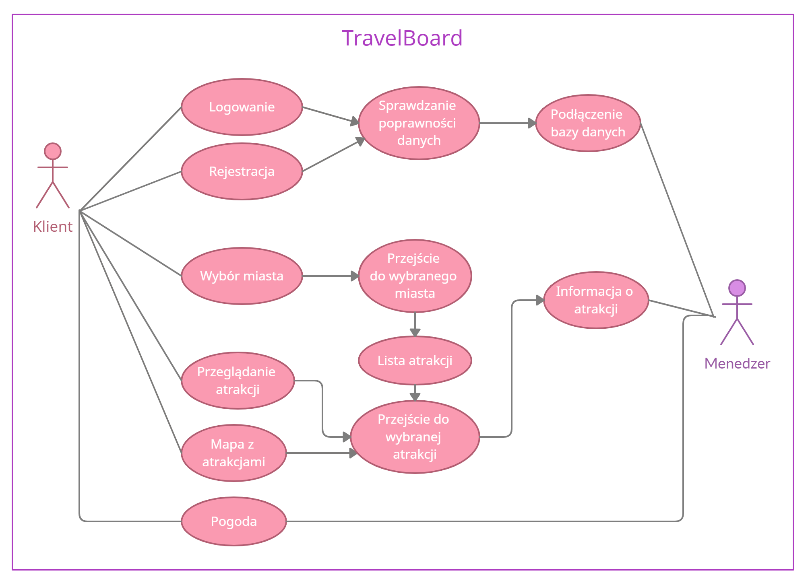

### ⠀Diagram wdrożenia

## 5. Architektura systemu/oprogramowania

### Architektura rozwoju 
| Lp | Nazwa produktu | Przeznaczenie w projekcie | Wersja  | 
|:-:|:-|:-|:-:|
|1|Java|Backend aplikacji|8|
|2|Xml|Struktura widoków aplikacji|--|
|3|SQLite|Zarządzanie relacyjną bazą danych z atrakcjiami | 3.35.3 |

### Architektura uruchomieniowa 
| Lp | Nazwa produktu | Przeznaczenie w projekcie | Wersja  | 
|:-:|:-|:-|:-:|
|1|Android Studio|Środowisko IDE używane przy tworzeniu projektu|4.1.2|
|2|Windows 10 |System operacyjny używany przy tworzeniu projektu|10.0.19041.867|
|3|Git| Systemy kontroli wersji aplikacji |2.31.1|
|4|GitHub| Utrzymywanie projektu na serwerze, do którego mają dostęp członkowie zespołu|--|

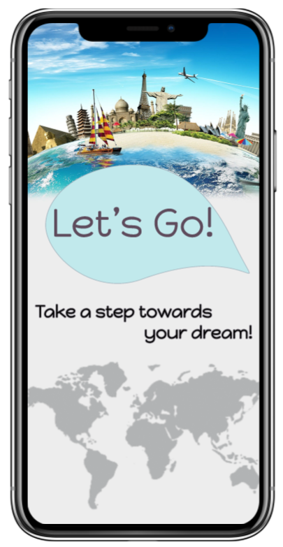  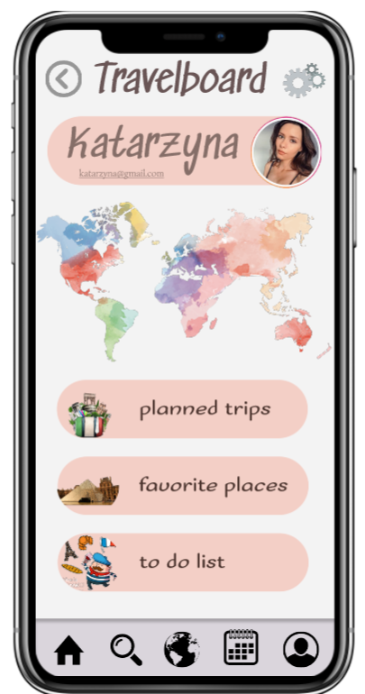 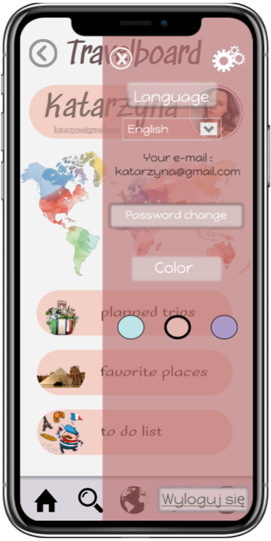 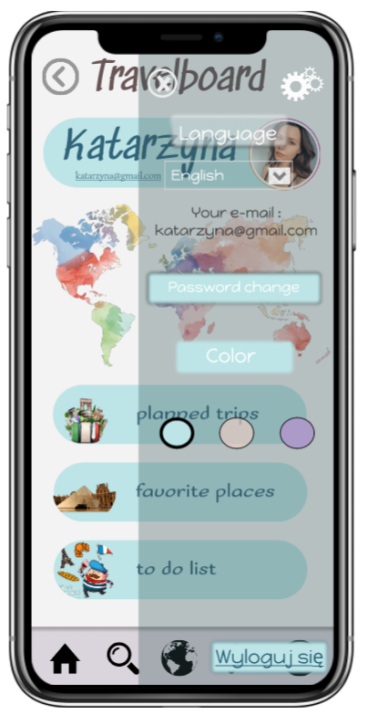 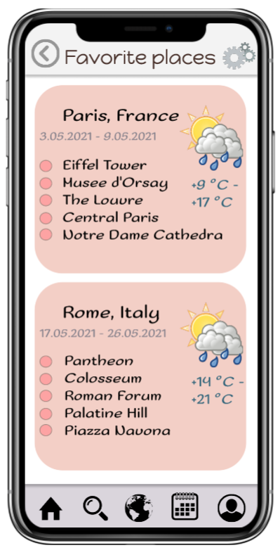 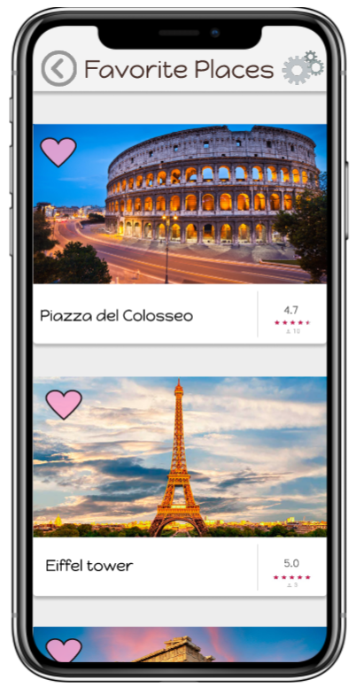 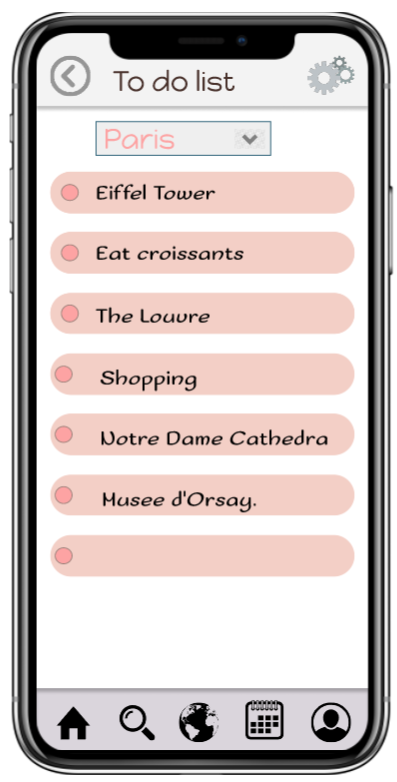 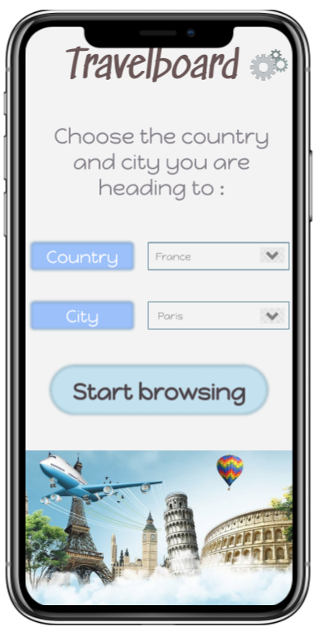 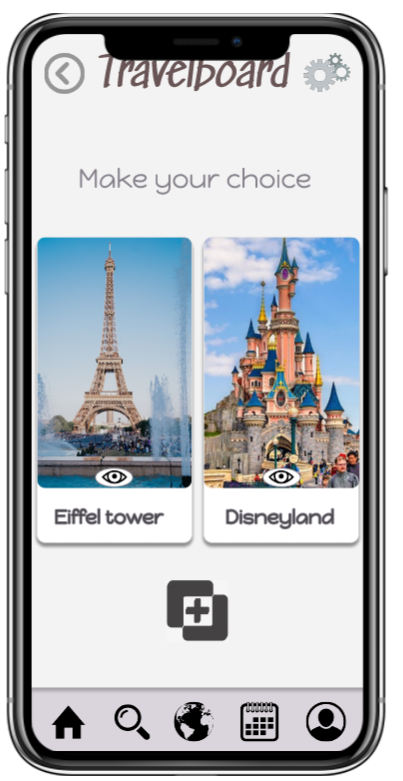 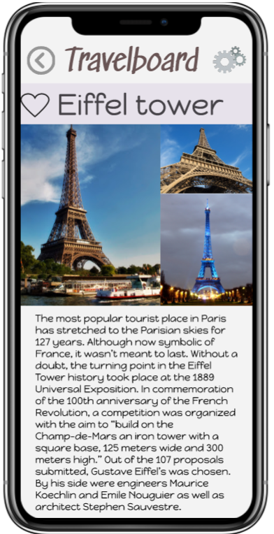 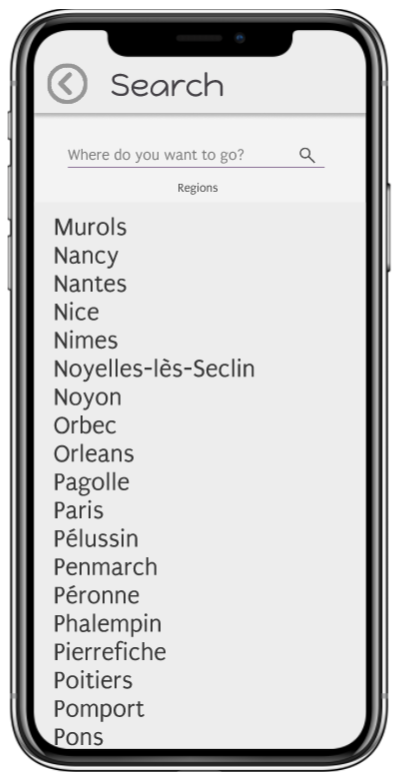  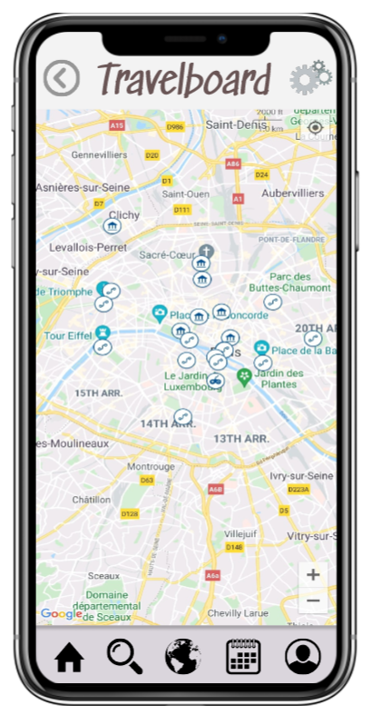 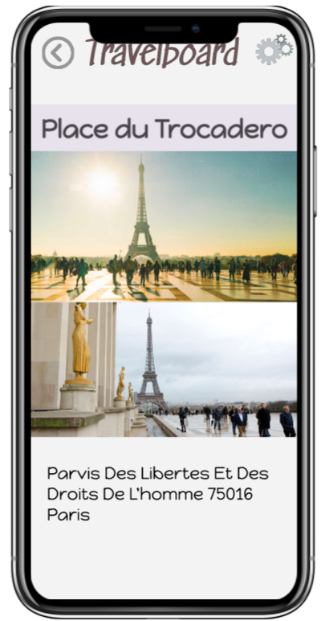 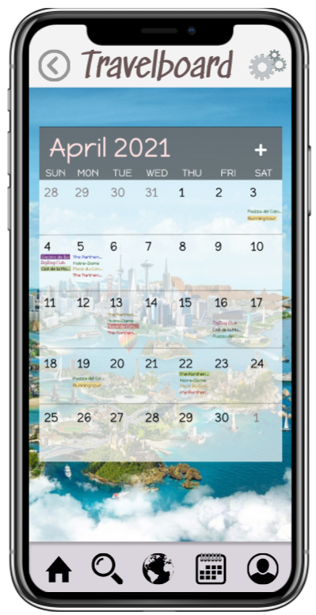

## 6. Scenariusze testów
| Identyfikator | Priorytet |Kroki do wykonania | Oczekiwany rezultat |  
|:-:|:-:|:-|:-|
|R1|1|Kliknąć przycisk 'Log in' i wpisać swoje dane do logowania do profilu (email, hasło)|Pojawienie się strony głównej aplikacji TravelBoard z menu|
|R2|1|Kliknąć przycisk 'Sign up'|Pojawienie się panelu rejestracyjnego do tworzenia profila użytkownika|
|R3|1|Kliknąć przycisk 'Wyszukaj' w menu głównym i wpisać wybrane miasto|Wyświetlenie modułu z atrakcjami wybranego miasta|
|R4|1|Kliknąć przycisk 'Mapa' w menu głównym|Wyświetlenie modułu z mapami (mapa z atrakcjami)|
|R5|2|||
|R6|2|Kliknąć wybraną atrakcje|Wyświetlenie atrakcji z opisem|
|R7|3|Kliknąć przycisk 'Pogoda' w ...|Wyświetlenie się modułu z pogodą|
|R8|2| Klikniąć przycisk 'Log in'|Sprawdzanie użytkownika w bazie danych i porównywanie hasełą|
|R8|2| Klikniąć przycisk 'Sign up'|1. Sprawdzanie, czy istnieje użytkownik o tej nazwie             2. Sprawdzanie haseł w dwóch polach                   3. Zapisanie użytkownika do bazy danych lub błąd rejestracji

